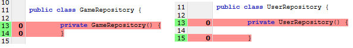
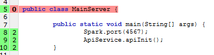
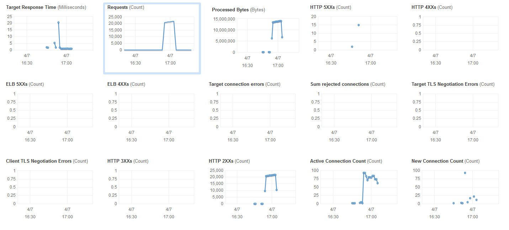

# Objective

Implement assignment [option 1](https://github.com/jesusjavierdediego/assignments)

### Clue Game
The objective is making the structure to build the clue game following the [requirements](/definitions/MVPRequirements)

1. A front App module to play
2. A services API to support the front module
3. API push to send messages to user meanwhile playing
4. A persistence module for logged-in users, their self-made games and their played games

### Minimum Value Product.

The goal is developing the point 2 and 3 as minimum requirements.

### Tools
- Maven to build project delivery
- SparkJava for endpoints API
- BDD for integration and acceptance test
- TDD for development
- Dockerfile to generate Dockers
- TravisCI for continuous integration [project url](https://travis-ci.com/fmsolana/assignment)
- DockerHub to registry container [project url](https://hub.docker.com/r/fmsolana/cluegame)
- Amazon ECS for deployments
- SoapUI for stresstest
- AmazonMQ for queue

##### [Destop Develop tool](/definitions/tools.txt)


### URLs
- http://ec2co-ecsel-148u7gdkhyabo-2121828102.us-east-2.elb.amazonaws.com:4567/smoke
- https://travis-ci.com/fmsolana/assignment
- https://hub.docker.com/r/fmsolana/cluegame

### Steps followed during development

1.  Write requirements in Gherkin
2.  BDD Test
3.  TDD test
4.	Write code


### Cobertura

For coverage report was execute 

```console
mvn cobertura:cobertura
```

The test cover the most of the code, less some exception.


- First Exception: Autogenerated code.

I generated with eclipse toString, Equals, and hashCode method, but I didn't made tests. Maybe It could be great that eclipse auto generate the test too, or maybe It is not necessary.


- Second Exception: Private Constructor or static class.



- Third Exception: 

The test for secure server was disabled because TravisCI execute in different order that my windows PC and the build failed. How all test are execute in same jvm, if the MainSecureServerTest is execute before  other test, then fail because the server initiated the secure context.

 


And again static class



Here the TravisCI error when @Ignore is not set in MainSecureServerTest


### Test

With SoapUI [here](/ClueGameApiSoapUI.xml). I did a load test during 10 minutes, first in local environment after against ECS. All test was running from pc.

#### The SoapUI data for Loadtest in localhost:

We could see that the behaviour during the test is stable, but the transaction per second go down meanwhile advance the execution, It's because the SoapUI test was run in same pc that run the server.

##### PC: Surface Pro 3 i5-4300U, 8GB, 256GBSSD


#### The SoapUI data for Loadtest in Amazon ECS:

The execution in Amazon is more stable in the time, after a while the graphs are plane. The average times is more than localhost test, the infrastructure is in Amazon Ohio.

##### Configuration for Amazon ECS  0,25 vCPU 	0,5 GB single container.


#### Graph with container during execution

The cpu up with request and down when the test finish. This show that works are not stuck after the requests end. 
The reservation memory is constant a lite down before up again.


#### Cluster Services graph

The cluster ECS present the same cpu that container, but the memory down before up again. We can see that the cluster free memory in same time that the container did it. I don't know why.


#### Amazon Balancer (ELB)

This graphs show how ELB attending the requests. It's very weird the 5XX errors because the SoapUI did show neither error.




##### [Task by day](/definitions/task)


